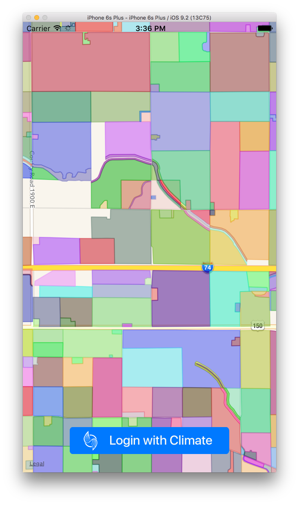

# Demo CLU App

This is a demo application showing how to:

1. Integrate with the [LoginWithClimate](https://github.com/TheClimateCorporation/LoginWithClimate) pod
2. Use the access token obtained after logging in to make a call to the Climate.com [public API](https://climate.com/static/dev-portal/index.html) to obtain CLU geometries
3. Draw those geometries on an MapKit map view using Climate's open source [GeoFeatures](https://github.com/tonystone/GeoFeatures) library.

# Usage

1. Clone the repository
2. Create a developer account and generate an application client id and secret pair on our [developer portal](https://climate.com/static/dev-portal/index.html)
3. Add your client id and client secret in [ViewController.swift](https://github.com/TheClimateCorporation/DemoCLUs/blob/master/DemoCLUs/ViewController.swift#L28).
4. Run it!

